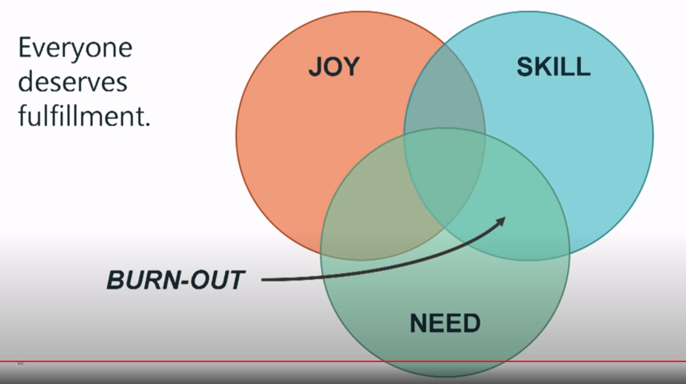

# Data structures

## List (from De-Coding the Interview Process)

### Stacks

Works like git stash\
Last in - First out\
Implementation in javascript: [Stacks](https://github.com/felipe-zapata/coding/blob/master/data-structures/Stack.js)

#### Methods:

* pop(): Removes the top item from the stack
* push(item): Adds an item to the top of the stack
* peek(): Returns the item at the top of the stack (but does not remove it)
* isEmpty(): Returns true if the stack is empty
* get length(): Returns the number of items in the stack

.png>)

### Queues

Like rabbitmq\
First in - First out\
Typically used in breadth-first searches for trees or cache\
Implementation in javascript: [Queues](https://github.com/felipe-zapata/coding/blob/master/data-structures/Queue.js)

#### Methods:

* enqueue(): Add an item to the back of the queue
* dequeue() Remove the first item from the queue
* peek(): Return the item at the front of the queue (but do not remove it)
* isEmpty(): Check whether the queue is empty
* get length(): Returns the length of the queue

### Linked lists

### Graphs

### Trees

### Tries
